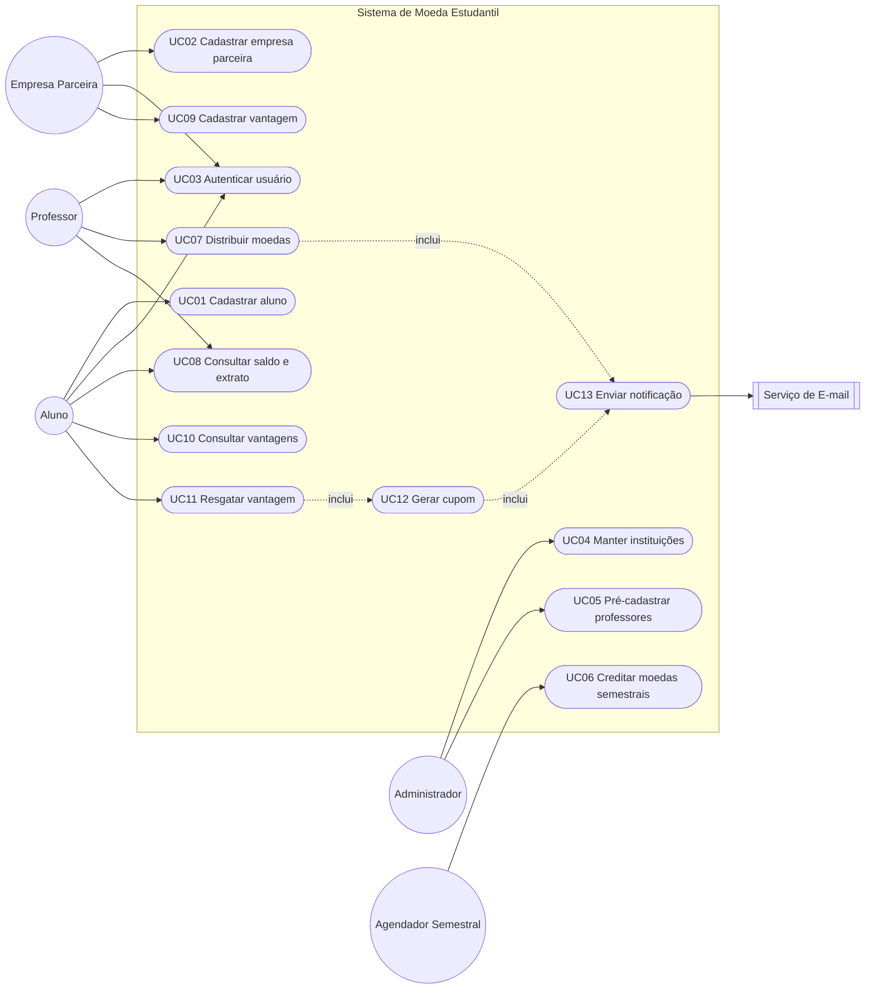
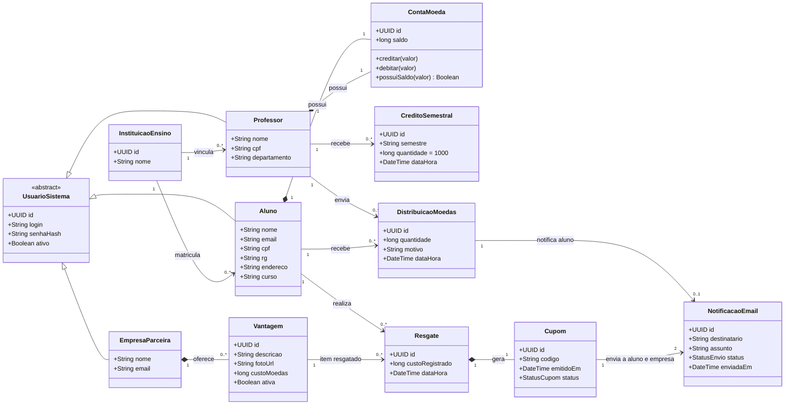
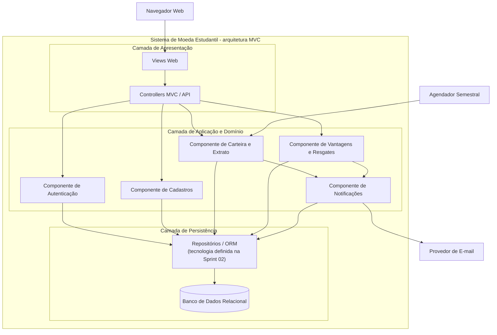

# Lab03S01 - Modelagem do Sistema de Moeda Estudantil

**Disciplina:** Projeto de Software  
**Sprint:** 01 - Modelagem do sistema  
**Artefatos:** Diagrama de Casos de Uso, Histórias do Usuário, Diagrama de Classes e Diagrama de Componentes

## 1. Visão e escopo

O Sistema de Moeda Estudantil reconhece o mérito acadêmico por meio de uma moeda virtual. Professores distribuem moedas a alunos; alunos consultam o saldo e trocam moedas por vantagens oferecidas por empresas parceiras.

### Requisitos identificados

| ID | Requisito funcional |
|---|---|
| RF01 | Permitir que o aluno se cadastre com nome, e-mail, CPF, RG, endereço, instituição de ensino e curso. |
| RF02 | Manter instituições e professores pré-cadastrados, vinculando cada professor a uma instituição. |
| RF03 | Permitir o cadastro de empresas parceiras. |
| RF04 | Autenticar alunos, professores e empresas parceiras com login e senha. |
| RF05 | Creditar 1.000 moedas a cada professor por semestre, acumulando o valor não utilizado. |
| RF06 | Permitir ao professor enviar moedas a um aluno, informando valor e motivo obrigatório, desde que possua saldo. |
| RF07 | Notificar o aluno por e-mail ao receber moedas. |
| RF08 | Permitir a alunos e professores consultar saldo e extrato de transações. |
| RF09 | Permitir à empresa cadastrar vantagens com descrição, foto e custo em moedas. |
| RF10 | Permitir ao aluno consultar as vantagens disponíveis. |
| RF11 | Permitir ao aluno resgatar uma vantagem se possuir saldo, descontando o custo da conta. |
| RF12 | Gerar um código de cupom único e enviá-lo por e-mail ao aluno e à empresa parceira após o resgate. |

### Premissas de modelagem

- O **Administrador do Sistema** representa a operação necessária para manter instituições e professores pré-cadastrados. Esse perfil é uma suposição de modelagem, pois o enunciado não define quem executa essa tarefa.
- O **Agendador Semestral** representa o gatilho automático que credita 1.000 moedas aos professores no início de cada semestre.
- Para a empresa parceira, foram modelados nome e e-mail como dados mínimos: o enunciado exige o cadastro da empresa e o envio do cupom por e-mail, mas não detalha os demais campos cadastrais.
- O saldo nunca pode ficar negativo. Distribuição e resgate devem ser operações atômicas.
- Senhas são armazenadas somente como hash. Essa é uma decisão de segurança, não um requisito textual do enunciado.
- A estratégia concreta de banco de dados/ORM fica para a Sprint 02; o componente de persistência desta sprint é independente de tecnologia.

## 2. Diagrama de Casos de Uso

> UC07 a UC11 exigem sessão autenticada. A autenticação foi mantida como caso de uso independente para evitar poluir o diagrama com relações repetidas.

### Especificação resumida dos casos de uso principais

| Caso de uso | Ator principal | Pré-condição | Fluxo principal e resultado |
|---|---|---|---|
| UC01 - Cadastrar aluno | Aluno | Instituição disponível para seleção | Informa os dados obrigatórios, escolhe a instituição e o curso e cria as credenciais. O sistema valida unicidade de CPF, RG, e-mail e login e cria a conta com saldo zero. |
| UC02 - Cadastrar empresa | Empresa Parceira | Não possuir cadastro | Informa identificação, e-mail e credenciais. O sistema valida os dados e cria a empresa. |
| UC03 - Autenticar usuário | Aluno, Professor ou Empresa | Usuário cadastrado e ativo | Informa login e senha. O sistema valida as credenciais e inicia uma sessão associada ao perfil. |
| UC06 - Creditar moedas semestrais | Agendador Semestral | Novo semestre identificado | Para cada professor ativo, registra um crédito de 1.000 moedas. O valor é somado ao saldo existente e a execução não pode duplicar o crédito do mesmo semestre. |
| UC07 - Distribuir moedas | Professor | Professor autenticado e com saldo suficiente | Seleciona aluno, informa valor positivo e motivo não vazio. O sistema debita o professor, credita o aluno, registra a distribuição e solicita o e-mail de notificação. Se o saldo for insuficiente, nada é alterado. |
| UC08 - Consultar saldo e extrato | Aluno ou Professor | Usuário autenticado | Exibe o saldo atual e as transações da própria conta em ordem cronológica decrescente. |
| UC09 - Cadastrar vantagem | Empresa Parceira | Empresa autenticada | Informa descrição, foto e custo positivo em moedas. O sistema associa a vantagem à empresa e a disponibiliza no catálogo. |
| UC11 - Resgatar vantagem | Aluno | Aluno autenticado, vantagem ativa e saldo suficiente | O sistema debita o custo, registra o resgate, gera um cupom único e envia o mesmo código ao aluno e à empresa. Se o saldo for insuficiente ou a vantagem estiver inativa, nada é alterado. |

## 3. Histórias do Usuário

### HU01 - Cadastro de aluno

**Como** aluno, **quero** criar minha conta selecionando minha instituição e informando meus dados acadêmicos, **para** participar do programa de reconhecimento.

Critérios de aceitação:

1. **Dado** que a instituição esteja pré-cadastrada, **quando** o aluno preencher nome, e-mail, CPF, RG, endereço, instituição, curso, login e senha válidos, **então** a conta deve ser criada com saldo zero.
2. **Dado** um CPF, RG, e-mail ou login já utilizado, **quando** o cadastro for enviado, **então** o sistema deve rejeitá-lo sem criar dados parciais.
3. **Dado** um campo obrigatório ausente, **quando** o cadastro for enviado, **então** o sistema deve informar os campos a corrigir.

### HU02 - Cadastro de empresa parceira

**Como** representante de uma empresa parceira, **quero** cadastrar a empresa e suas credenciais, **para** oferecer vantagens aos alunos.

Critérios de aceitação:

1. **Dado** que os dados e as credenciais sejam válidos, **quando** o cadastro for confirmado, **então** a empresa deve ser criada e poder se autenticar.
2. **Dado** um e-mail ou login já utilizado, **quando** o cadastro for enviado, **então** o sistema deve recusar a duplicação.

### HU03 - Autenticação

**Como** aluno, professor ou empresa parceira, **quero** entrar com login e senha, **para** acessar com segurança as funções do meu perfil.

Critérios de aceitação:

1. **Dado** um usuário ativo, **quando** forem informadas credenciais corretas, **então** o sistema deve iniciar uma sessão com o perfil correspondente.
2. **Dado** login inexistente ou senha incorreta, **quando** houver tentativa de acesso, **então** o sistema deve negar o acesso sem revelar qual campo está incorreto.
3. **Dado** um usuário não autenticado, **quando** tentar acessar uma operação protegida, **então** deve ser direcionado à autenticação.

### HU04 - Pré-cadastro institucional

**Como** administrador do sistema, **quero** manter instituições e pré-cadastrar professores vinculados a elas, **para** disponibilizar dados confiáveis no programa.

Critérios de aceitação:

1. **Dado** uma instituição participante, **quando** ela for cadastrada, **então** deve aparecer na seleção do cadastro de aluno.
2. **Dado** nome, CPF, departamento, login, senha inicial e instituição, **quando** o professor for pré-cadastrado, **então** deve ser criado explicitamente vinculado à instituição.
3. **Dado** um CPF ou login existente, **quando** o pré-cadastro for solicitado, **então** o sistema deve impedir a duplicidade.

### HU05 - Crédito semestral

**Como** professor, **quero** receber 1.000 moedas a cada semestre, **para** reconhecer o mérito dos meus alunos.

Critérios de aceitação:

1. **Dado** o início de um novo semestre, **quando** o processamento semestral ocorrer, **então** 1.000 moedas devem ser somadas ao saldo de cada professor ativo.
2. **Dado** um saldo remanescente, **quando** o novo crédito ocorrer, **então** o saldo anterior deve ser preservado e acrescido de 1.000.
3. **Dado** que o semestre já tenha sido processado, **quando** a rotina for executada novamente, **então** nenhum professor deve receber crédito duplicado.

### HU06 - Distribuição de moedas

**Como** professor, **quero** enviar moedas a um aluno e registrar o motivo, **para** reconhecer sua participação ou bom comportamento.

Critérios de aceitação:

1. **Dado** saldo suficiente, aluno válido, valor positivo e motivo preenchido, **quando** o professor confirmar, **então** o valor deve ser debitado do professor e creditado ao aluno em uma única transação.
2. **Dado** saldo insuficiente, **quando** o professor tentar enviar moedas, **então** o sistema deve recusar a operação sem alterar nenhum saldo.
3. **Dado** valor não positivo ou motivo vazio, **quando** houver tentativa de envio, **então** a operação deve ser rejeitada.
4. **Dado** uma distribuição concluída, **quando** a transação for confirmada, **então** o aluno deve receber um e-mail contendo valor, professor e motivo.

### HU07 - Consulta de saldo e extrato

**Como** aluno ou professor, **quero** consultar meu saldo e minhas transações, **para** acompanhar a movimentação da conta.

Critérios de aceitação:

1. **Dado** um usuário autenticado, **quando** abrir o extrato, **então** deve visualizar seu saldo atual e somente suas transações.
2. **Dado** um professor, **quando** consultar o extrato, **então** deve ver créditos semestrais e envios realizados.
3. **Dado** um aluno, **quando** consultar o extrato, **então** deve ver moedas recebidas e resgates realizados.

### HU08 - Cadastro de vantagem

**Como** empresa parceira, **quero** cadastrar uma vantagem com descrição, foto e custo, **para** disponibilizá-la aos alunos.

Critérios de aceitação:

1. **Dado** descrição e foto preenchidas e custo positivo, **quando** a empresa confirmar o cadastro, **então** a vantagem deve ser vinculada à empresa e ficar disponível no catálogo.
2. **Dado** custo nulo ou não positivo, **quando** o cadastro for enviado, **então** o sistema deve rejeitar a vantagem.
3. **Dado** um usuário que não represente a empresa proprietária, **quando** tentar alterar a vantagem, **então** o sistema deve negar a operação.

### HU09 - Consulta de vantagens

**Como** aluno, **quero** visualizar as vantagens disponíveis e seus custos, **para** escolher onde utilizar minhas moedas.

Critérios de aceitação:

1. **Dado** um aluno autenticado, **quando** acessar o catálogo, **então** deve ver as vantagens ativas com descrição, foto, empresa e custo.
2. **Dado** uma vantagem inativa, **quando** o catálogo for exibido, **então** ela não deve estar disponível para resgate.

### HU10 - Resgate de vantagem

**Como** aluno, **quero** trocar minhas moedas por uma vantagem, **para** utilizar o benefício presencialmente.

Critérios de aceitação:

1. **Dado** saldo suficiente e vantagem ativa, **quando** o aluno confirmar o resgate, **então** o custo deve ser debitado, o resgate registrado e um cupom único gerado em uma única transação.
2. **Dado** saldo insuficiente, **quando** o aluno tentar resgatar, **então** o sistema deve recusar a operação sem alterar o saldo.
3. **Dado** uma vantagem inativa, **quando** houver tentativa de resgate, **então** o sistema deve impedir a operação.
4. **Dado** um resgate concluído, **quando** o cupom for gerado, **então** aluno e empresa devem receber por e-mail o mesmo código de conferência.

## 4. Diagrama de Classes

### Invariantes do domínio

- `ContaMoeda.saldo >= 0`.
- Quantidade distribuída e custo da vantagem devem ser maiores que zero.
- Toda `DistribuicaoMoedas` possui professor, aluno, quantidade e motivo não vazio.
- Existe no máximo um `CreditoSemestral` por professor e semestre.
- `Vantagem.custoMoedas` é copiado para `Resgate.custoRegistrado`, preservando o histórico mesmo se o custo mudar depois.
- `Cupom.codigo` é único e o mesmo código é comunicado ao aluno e à empresa.
- Débitos, créditos e registros associados são persistidos de forma atômica.

## 5. Diagrama de Componentes

### Responsabilidades dos componentes

| Componente | Responsabilidade |
|---|---|
| Views Web | Formulários, catálogo, saldo, extrato e feedback ao usuário. |
| Controllers MVC/API | Receber requisições, validar formato de entrada, aplicar autorização por perfil e coordenar casos de uso. |
| Autenticação | Validar credenciais, manter sessões e proteger operações por perfil. |
| Cadastros | Cadastrar alunos e empresas e manter instituições/professores pré-cadastrados. |
| Carteira e Extrato | Controlar saldos, créditos semestrais, distribuições e consultas de extrato. |
| Vantagens e Resgates | Manter o catálogo, validar saldo/vantagem, registrar o resgate e gerar cupom único. |
| Notificações | Montar, enviar e registrar e-mails de distribuição e resgate. |
| Repositórios/ORM | Isolar o domínio do mecanismo de persistência e controlar transações atômicas. |

## 6. Rastreabilidade

| Requisito | Caso de uso | História | Classes centrais | Componente principal |
|---|---|---|---|---|
| RF01 | UC01 | HU01 | Aluno, InstituicaoEnsino, ContaMoeda | Cadastros |
| RF02 | UC04, UC05 | HU04 | InstituicaoEnsino, Professor | Cadastros |
| RF03 | UC02 | HU02 | EmpresaParceira | Cadastros |
| RF04 | UC03 | HU03 | UsuarioSistema | Autenticação |
| RF05 | UC06 | HU05 | Professor, ContaMoeda, CreditoSemestral | Carteira e Extrato |
| RF06, RF07 | UC07, UC13 | HU06 | DistribuicaoMoedas, ContaMoeda, NotificacaoEmail | Carteira e Extrato / Notificações |
| RF08 | UC08 | HU07 | ContaMoeda, CreditoSemestral, DistribuicaoMoedas, Resgate | Carteira e Extrato |
| RF09 | UC09 | HU08 | EmpresaParceira, Vantagem | Vantagens e Resgates |
| RF10 | UC10 | HU09 | Vantagem | Vantagens e Resgates |
| RF11, RF12 | UC11, UC12, UC13 | HU10 | Resgate, Vantagem, Cupom, NotificacaoEmail | Vantagens e Resgates / Notificações |

## 7. Definição de pronto da Sprint 01

- [x] Requisitos do enunciado identificados e numerados.
- [x] Atores, fronteira do sistema e casos de uso modelados.
- [x] Histórias do usuário com critérios verificáveis.
- [x] Classes, relacionamentos, multiplicidades e invariantes modelados.
- [x] Componentes alinhados à arquitetura MVC exigida para o projeto.
- [x] Rastreabilidade entre requisitos e artefatos registrada.
- [ ] Validar as premissas de Administrador e Agendador com a professora.
- [ ] Atualizar os modelos nas próximas sprints sempre que a implementação revelar novas regras.
